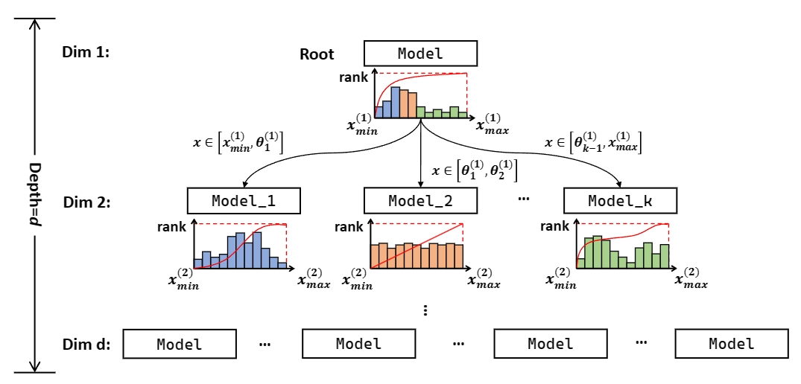
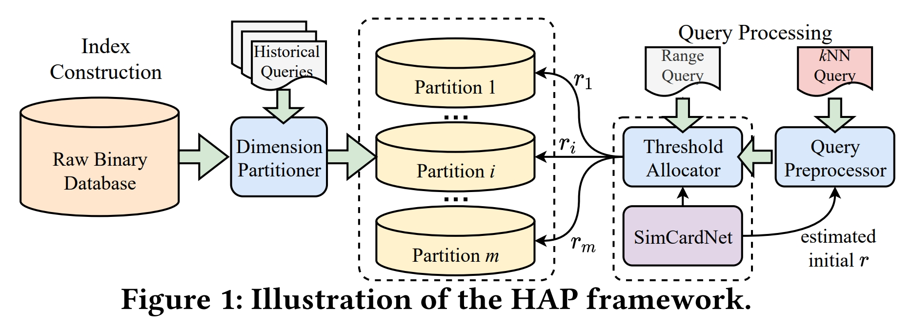
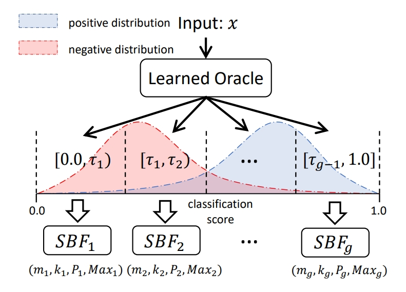

Selected Publications
=====

    
    HAP: An Efficient Hamming Space Index Based on Augmented Pigeonhole Principle.
    **Qiyu Liu**, Yanyan Shen, and Lei Chen
    SIGMOD 2022
    sd

    hello
    jj
    jj
    jj

    hello
    jj
    jj
    jj

1. **Qiyu Liu**, Yanyan Shen, and Lei Chen, HAP: An Efficient Hamming Space Index Based on Augmented Pigeonhole Principle, SIGMOD 2022
1. **Qiyu Liu**, Yanyan Shen, and Lei Chen, LHist: Towards Learning Multi-dimensional Histogram for Massive Spatial Data, ICDE 2021
1. **Qiyu Liu**, Libin Zheng, Xiang Lian, and Lei Chen, Efficiently Discovering Regions of Interest with User-Defined Score Function, DASFAA 2021
1. **Qiyu Liu**, Libin Zheng, Yanyan Shen, and Lei Chen, Finish Them on the Fly: An Incentive Mechanism for Real-Time Spatial Crowdsourcing, DASFAA 2020 (**Best Paper Runnerup**)
1. **Qiyu Liu**, Yanyan Shen, and Lei Chen, Stable Learned Bloom Filters for Data Streams, VLDB 2020
1. **Qiyu Liu**, Libin Zheng, and Lei Chen, RIDE: A System for Generalized Region of Interest Discovery and Exploration, ICDE 2020
1. **Qiyu Liu**, Xiang Lian, and Lei Chen, Probabilistic Maximum Range-Sum Queries on Spatial Database, SIGSPATIAL 2019 (**Best Paper Candidate**)
1. **Qiyu Liu**, Yuxiang Zeng, Lei Chen, and Xiuwen Zheng, Social-Aware Optimal Electric Vehicle Charger Deployment on Road Network, SIGSPATIAL 2019
  
